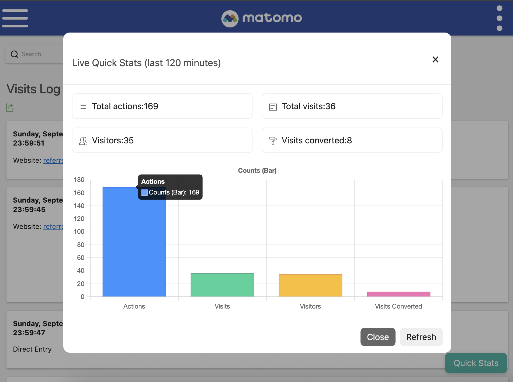
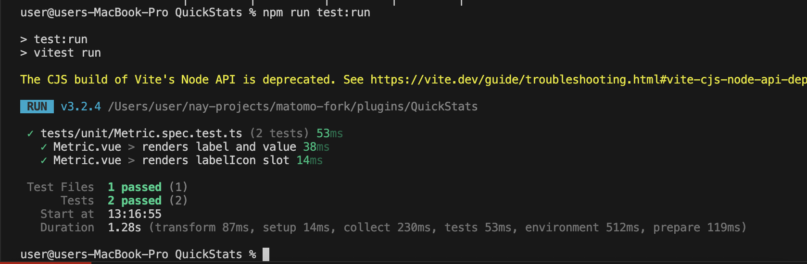
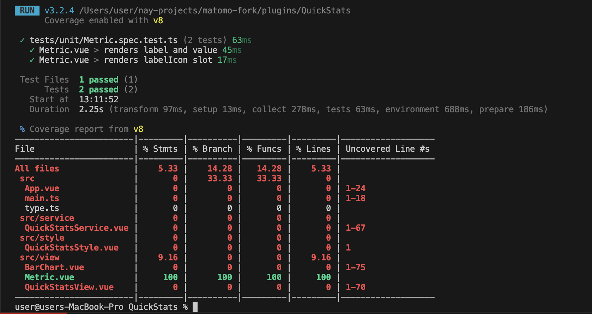

    Author - Nay Oo Kyaw
    Email - nayookyaw.nok@gmail.com

# Feature Overview
I developed a Quick Stats feature with a floating button that provides users with instant visibility into key activity metrics.  
* Floating button trigger
    - A discreet button floats on the all page.
    - When the user clicks it, a modal window opens showing live statistics.

* Displayed statistics
    1. Total actions
    2. Total visits
    3. Visitors
    4. Visits converted

* Refresh capability
    - A Refresh button is available inside the modal.
    - Clicking it triggers a live data fetch, ensuring users always see up-to-date stats without reloading the entire page.

* Additional design details
    - Each metric is displayed with an icon and a label for quick recognition.
    - Metrics are arranged in a grid layout for a clean, consistent look.
    - The modal also integrates a bar chart for visual representation of counts.

# Technologies that I used
1. TypeScript 
2. Vue JS v3

# Feature UI Demo

# Feature Demo Video Link
https://drive.google.com/file/d/18_qjVa6FfYjIt_Qd33mayplgVlICrW38/view?usp=sharing

# What I want to improve
1. I want to add more coverage testing.
2. Currently, I have done only unit testing for Metric.vue file.
3. As we see in screenshots, the coverage testing is only Metric.vue file (with green highlight)
4. I want to change the API with <i>token_auth</i>
5. Currently, I enabled the anonymous view option, which I did not want to enable.

# UI Testing (unit testing)

# How to install dependencies
* Nagivate into feature root path (QuickStats)
- npm install
- npm run build

After you build, you should see TWO files (quickstats.js and quickstats.main.css) in <b>dist</b> folder.  

# How to activate my plugin
- ddev matomo:console plugin:activate QuickStats

# Dependencies that I used in this plugin
1. "@coreui/icons": "^3.0.1",
2. "@coreui/icons-vue": "^2.2.0",
3. "axios": "^1.12.2",
4. "chart.js": "^4.5.0",
5. "vue": "^3.4.0"

1. UI Testing Dependencies 
    1. vitest 
    2. @vue/test-utils 
    3. @testing-library/vue 
    4. jsdom 
    5. @vitest/coverage-v8
